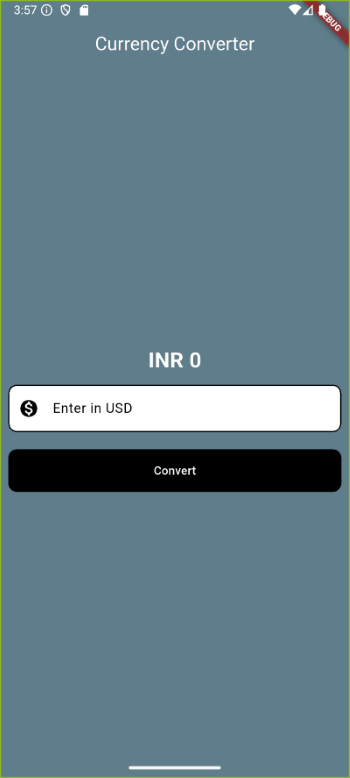

# Currency Converter App (USD to INR)

A basic Flutter app that converts **USD to INR** using a fixed exchange rate (not real-time). This is a beginner-friendly project built to practice Flutter development.

## Features

- Converts USD to INR
- Simple and user-friendly interface
- Built using Flutter and Dart

## Screenshots

*(Add a screenshot here if you want)*  


## Built With

- Flutter
- Dart

## How to Run

1. Clone the repository:

```bash
git clone https://github.com/Naveench8486/Currency-Converter-App.git
cd Currency-Converter-App
